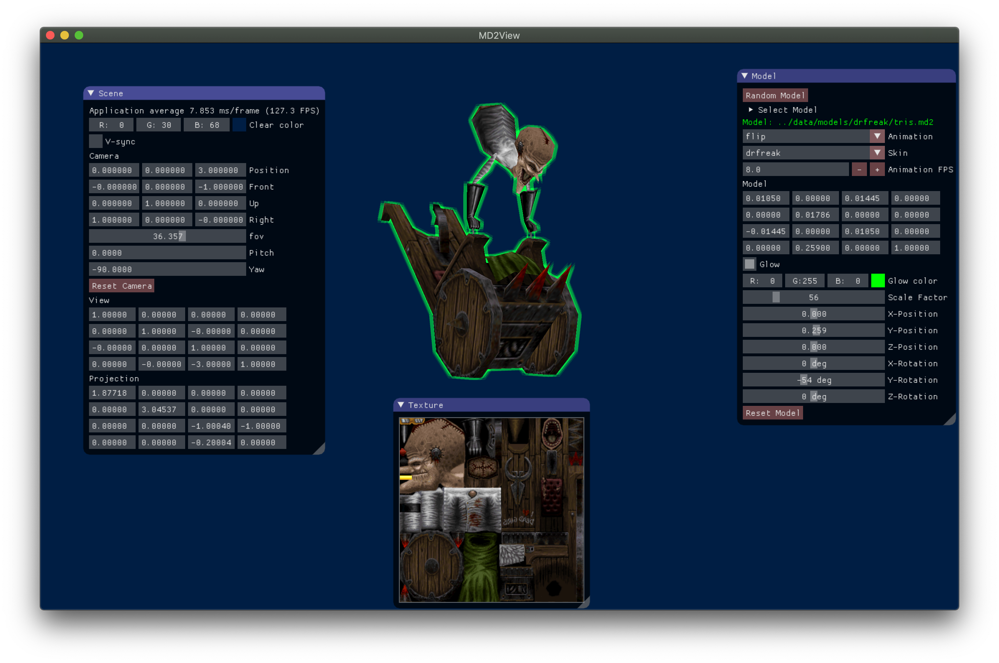
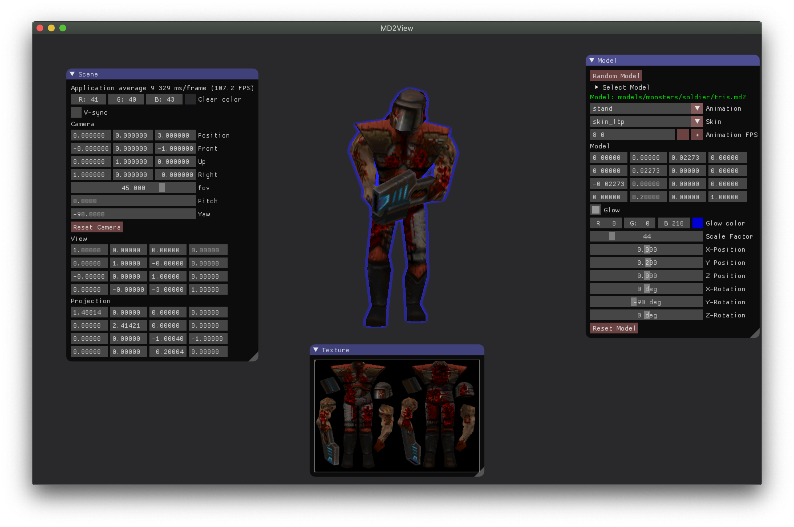

# md2view
**This is a personal project used for learning. Pull requests will mostly be ignored.**

The purpose of this project is to be able to load, render, texture, and animate
MD2 models that are stored in *Quake II* PAK files or which have been extracted into
an equivalent directory structure. The rendering is currently done in OpenGL 4. 
Support for a Vulkan renderer is currently in progress.

Here are some screenshots of md2view in action:

## Features

Using the GUI you can manipulate the model transform and observe the updated matrix.
You can control the camera by pressing F1. The camera controls are:

    * W - Forward
    * S - Backward
    * A - Left
    * D- Right
    * Mouse - Pitch / Yaw
    * Scroll wheel - Field of View

The FOV can also be adjusted with the GUI. The curret view and projection matrices
will be displayed in the GUI when you manipulate the camera.

You can use the GUI to enable an optional post-processing "glow" effect around the
model. You can set the color to use as well.

## Renders 

The OpenGL renderer is compiled into the `glmd2v` binary target. 
The Vulkan renderer (incomplete) is compiled into the `vkmd2v` binary target.

## Testing

md2view is currently being tested on the following systems:

    * Windows 10 (VS 2019) - NVIDIA GeForce RTX 3080 Ti
    * Windows 11 (VS 2019) - NVIDIA Geforce RTX 4060 Laptop GPU

md2view has previously been tested the following systems but may no longer work:

    * Mac OS X Mojave (10.14.6) - AMD Radeon R9 M370X
    * Ubuntu 18.04.3 LTS - NVIDIA GeForce GTX 1050 Ti

The screenshots above come from the Macbook which partly explains the low FPS.

## Dependencies

md2view is built using vcpkg to manage dependencies. These dependencies are:

[Boost](https://www.boost.org/)

[GLFW](https://www.glfw.org/) 

[GLEW](http://glew.sourceforge.net/) 

[GLM](https://glm.g-truc.net/0.9.9/index.html) 

[Dear ImGui](https://github.com/ocornut/imgui) 

[stb](https://github.com/nothings/stb)

[spdlog](https://github.com/gabime/spdlog)

[treehh](https://github.com/kpeeters/tree.hh)

[gsl-lite](https://github.com/gsl-lite/gsl-lite)

[ranges-v3](https://github.com/ericniebler/range-v3)

## Attributions

While I have used many resources for learning OpenGL the one I personally like best is:

[learnopengl.com](https://www.learnopengl.com)

Which is authored by [Joey de Vries](https://twitter.com/JoeyDeVriez).
The code for those tutorials is licensed under [CC BY 4.0](https://creativecommons.org/licenses/by-nc/4.0/legalcode).
Code for the camera and the blur shader is derived from those tutorials with modifications/customizations.

For learning Vulkan I am using this [Vulkan Tutorial](https://vulkan-tutorial.com/)

The inspiration for the glow post-processing effect came from [Makin' Stuff Look Good](https://www.youtube.com/watch?v=SMLbbi8oaO8)

For learning to read and work with the various file formats I used the following sources:

PCX - <https://www.fileformat.info/format/pcx/egff.htm>

PAK - <https://quakewiki.org/wiki/.pak>

MD2 - <http://www.mbsoftworks.sk/tutorials/opengl3/24-animation-pt1-keyframe-md2/> and <http://tfc.duke.free.fr/coding/md2-specs-en.html>
