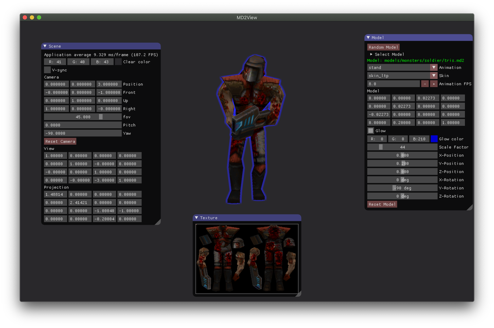

# md2view
This is a personal project used for learning. Issue reports or pull requests will mostly be ignored.

The purpose of this project is to be able to load, render, texture, and animate
MD2 models that are stored in Quake2 PAK files or which have been extracted into
a directory structure. The rendering is currently done in OpenGL.

Here are some screenshots of md2view in action:

## Features

Using the GUI you can manipulate the model transform and observe the updated matrix.
You can control the camera by pressing F1. The camera controls are:

    * W - Forward
    * S - Backward
    * A - Left
    * D- Right
    * Mouse - Pitch / Yaw
    * Scroll wheel - Field of View

The FOV can also be adjusted with the GUI. The curret view and projection matrices
will be displayed in the GUI when you manipulate the camera.

## Testing

md2view has been tested this on the following systems:

    * Mac OS X Mojave (10.14.6) - AMD Radeon R9 M370X
    * Ubuntu 18.04.3 LTS - NVIDIA GeForce GTX 1050 Ti

## Dependencies

md2view is built using a locally managed toolchain for build dependencies. These dependencies are:

    * Boost (1.69.0 filesystem, system, program_options)
    * GLFW (3.3)
    * GLEW (2.1.0)
    * GLM (0.9.9.0)
    * SOIL (20080707)
    * Dear ImGui (1.50, bundled with md2view)

## Attributions

While I have used many resources for learning OpenGL the one I personally like best is:

[learnopengl.com](https://www.learnopengl.com)

Which is authored by [Joey de Vries](https://twitter.com/JoeyDeVriez)
The code for those tutorials is licensed under [CC BY 4.0](https://creativecommons.org/licenses/by-nc/4.0/legalcode).
Code for the camera and the blur shader is derived from those tutorials with modifications/customizations.

For learning to read and work with the various file formats I used the following sources:

    * PCX <https://www.fileformat.info/format/pcx/egff.htm>
    * PAK <https://quakewiki.org/wiki/.pak>
    * MD2 <http://www.mbsoftworks.sk/tutorials/opengl3/24-animation-pt1-keyframe-md2/> and
          <http://tfc.duke.free.fr/coding/md2-specs-en.html>
